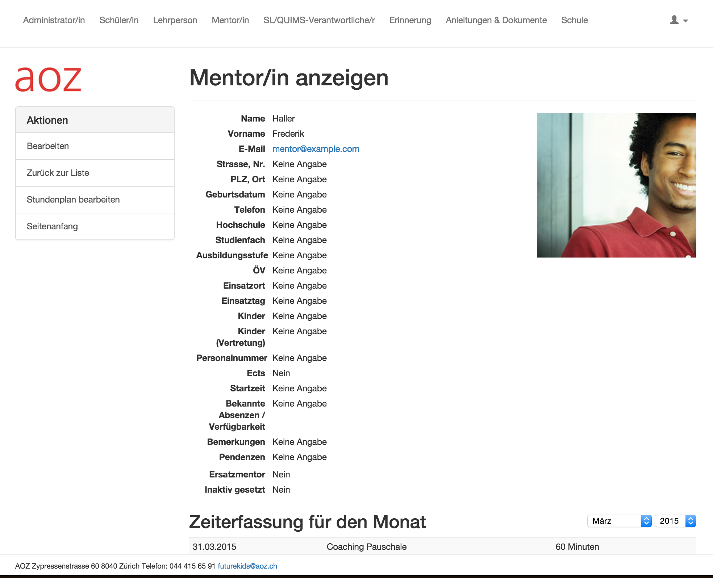
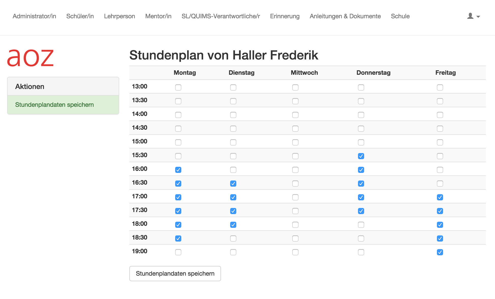
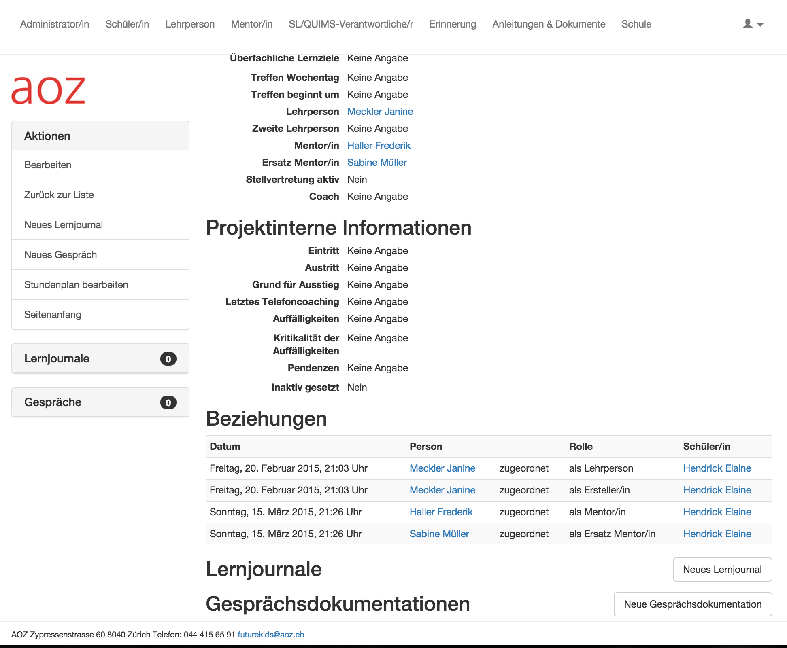
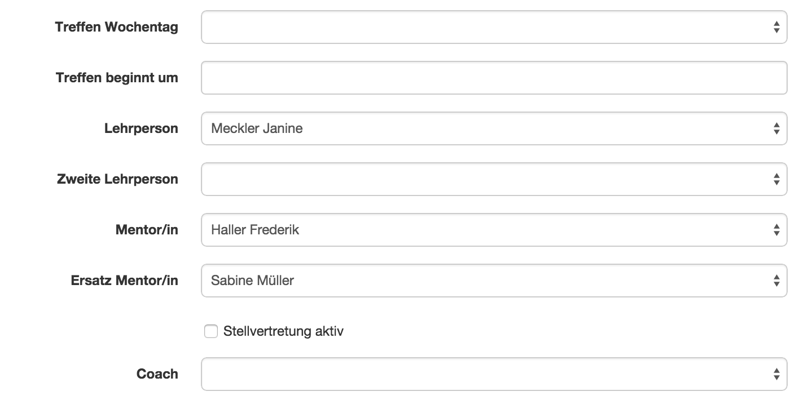
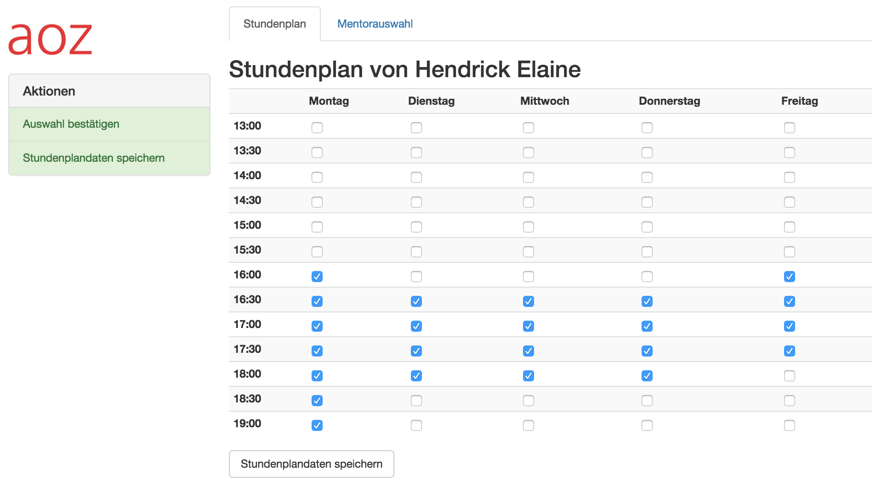
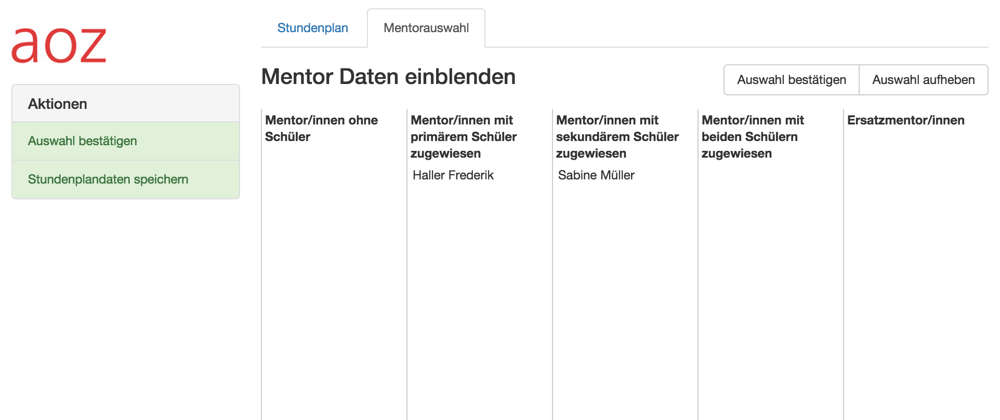

\pagebreak

# Ist-Analyse

## Bestehende Lösung

Die bestehende Lösung ist eine Webapplikation welche mittels dem Framework *Ruby on Rails* [^fnRubyOnRails] entwickelt wurde. Sie wurde von der Firma Panter AG und Freiwilligen entwickelt, der Quellcode ist auf Github verfügbar [^fnFuturekidsGithub] und unter der *GNU Affero General Public License*[^fnGnuAffero] lizenziert.

Die Lösung kann angepasst und erweitert werden und es besteht die Möglichkeit, Änderungen auf einen Staging-Server zu stellen, welcher die AOZ zur Verifizierung nutzen kann.

[^fnRubyOnRails]: http://rubyonrails.org/

[^fnFuturekidsGithub]: https://github.com/panterch/future_kids

[^fnGnuAffero]: http://de.wikipedia.org/wiki/GNU_Affero_General_Public_License

### Mentoren

Administratoren können neue Mentoren erfassen und bestehende bearbeiten. Abbildung \ref{screenshot_mentor_current} zeigt die Profilseite eines Mentors. Es ist anzumerken, dass das Geschlecht eines Mentors nicht zugewiesen werden kann. Diese Funktion muss ergänzt werden um \ref{sc-010} zu erfüllen. Auch die Model-Klasse des Mentors oder der abgeleiteten `User`-Klasse enthält kein passendes Feld.

Unter "Stundenplan bearbeiten" können die Zeitfenster bearbeitet werden, an denen ein Mentor verfügbar ist. Abbildung \ref{screenshot_mentor_time_current} zeigt, wie die Zeitfenster eingestellt werden können. Die Zeitfenster können in 30min Intervallen erfasst werden, von 13:00 bis 19:30, jeweils Montags bis Freitags. Es können beliebige Zeitfenster und -Kombinationen angeklickt werden. Dies erfüllt bereits \ref{sc-001} und \ref{sc-002} teilweise.

Listing \ref{lstMentorRb} zeigt die Beziehungen einer Mentor-Entität. Zu sehen ist, dass im Datenmodell einem Mentor mehrere Schüler zugewiesen werden können.

~~~~~{caption="Mentor-Klasse in Ruby (mentor.rb)" label=lstMentorRb}
class Mentor < User

  has_many :kids
  has_many :secondary_kids, :class_name => 'Kid',
           :foreign_key => 'secondary_mentor_id'
  has_many :journals
  has_many :reminders
  has_many :secondary_reminders, :class_name => 'Reminder',
           :foreign_key => 'secondary_mentor_id'
  has_many :schedules, :as => :person
  belongs_to :primary_kids_school, :class_name => 'School'
  belongs_to :primary_kids_admin, :class_name => 'Admin'

~~~~~

### Schüler

Schüler können ähnlich wie Mentoren bearbeitet werden. Abbildungungen \ref{screenshot_kid_top} und \ref{screenshot_kid_bottom} zeigt die Profilseite eines Schülers. Im Gegensatz zu einem Mentoren kann ein Geschlecht zugewiesen werden. 

Im unterem Teil des Bildschirms können die zugewiesenen Lehrer und Mentoren angesehen werden.

Editiert man einen Schüler unter "Bearbeiten" können unter anderem Mentoren zugewiesen werden, sowie Wochentag und Zeitpunkt des Treffens des Mentoren mit dem Schüler. (Abbildung \ref{screenshot_kid_assign_mentor}, Story \ref{sc-005}). 

Unter "Stundenplan bearbeiten" lassen sich analog zum Mentor die Zeitfenster eines Schülers einstellen (Abbildung \ref{screenshot_kid_timetable}). Dies erfüllt \ref{sc-003} und \ref{sc-004} teilweise. Dieser Bildschirm hat zudem eine weitere Funktion: Es können Mentoren ausgewählt werden, deren Zeitfenster mit denen des Schülers verglichen werden können. Eine direkte Wahl und Zuweisung eines Mentors aus diesem Bildschirm heraus ist nicht möglich.

