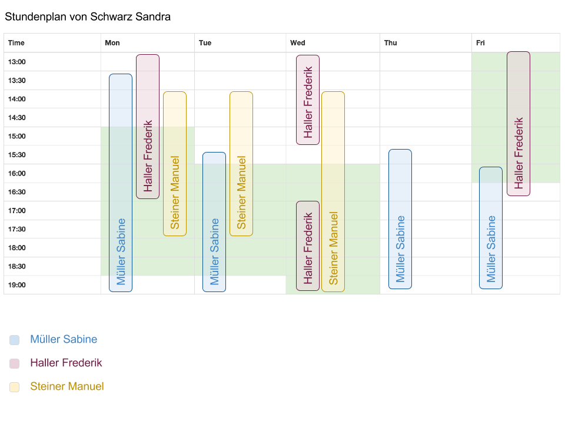
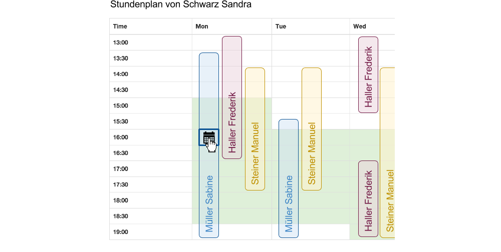
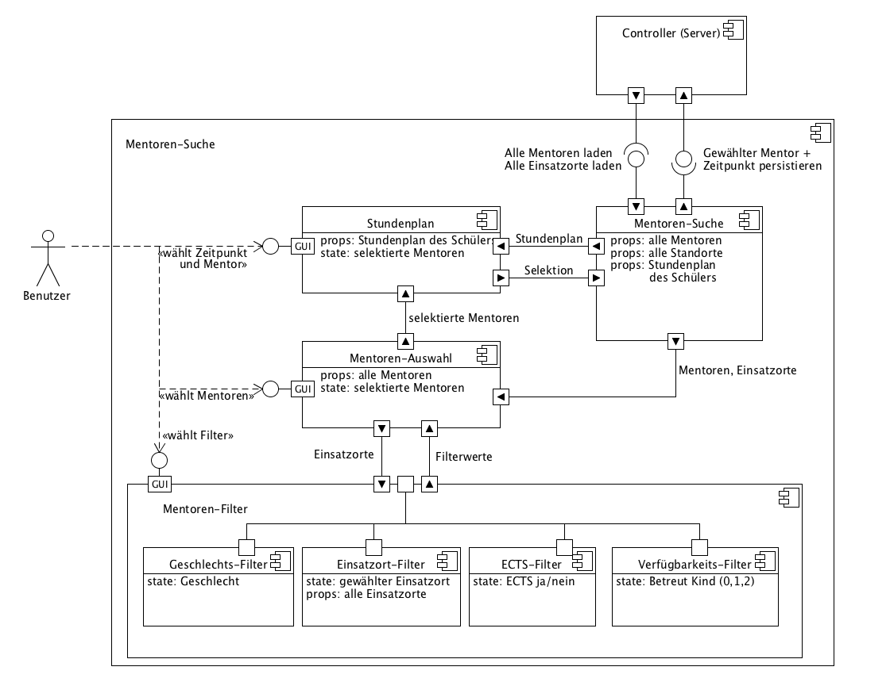

\pagebreak

# Design & Architektur

## Mentoren-Auswahl

Für die Auswahl der Mentoren wird ein neuer Bildschirm erstellt. Er dient dazu, aus allen im System erfassten Mentoren zu filtern und die Zeitfenster der ausgewählten Mentoren mit denen des Schülers zu vergleichen. Dazu stehen diverse Filtermöglichkeiten zur Verfügung. Weiterhin soll es möglich sein, ein Treffen zwischen Mentor und Schüler zu persistieren (Wochentag und Zeitpunkt), gemäss \ref{sc-015}. Diese direkte Zuweisung reduziert die in \ref{nfr-04} beanstandeten Anzahl Klicks.

### Filter und Auswahl für den Vergleich \label{mentor_selection_and_filters}

Die Auswahl der Mentoren geschieht in zwei Schritten:

1. Filter definieren die zur Auswahl stehenden Mentoren, diese sollen initial auf sinnvolle Werte gesetzt sein.
2. Aus den gefilterten Mentoren können bestimmte Mentoren für den Vergleich mit dem Schüler ausgewählt werden. 

Durch dieses Zwei-Schritte Verfahren soll sichergestellt werden, dass die Übersicht sowohl bei vielen möglichen Mentoren, als auch im Fall, dass nur wenige passende Mentoren zur Verfügung stehen, nicht eingeschränkt ist. 

(TODO: mock)

Die einzelnen Filter reduzieren die Mentoren für die Suche nach Kriterien, die jeweils mit UND verknüpft werden,
d.h. Geschlecht=m und ECTS=true wird alle männlichen Mentoren anzeigen, welche ECTS Punkte bekommen:

#### Geschlecht

Hat drei Zustände: nichts ausgewählt, m oder f.

Ist nichts ausgewählt, so wird nicht nach Geschlecht gefiltert

#### ECTS

Hat drei Zustände: nichts ausgewählt, true oder false:

- ECTS=true: alle Mentoren, die ECTS-Punkte bkeommen
- ECTS=false: alle Mentoren, die nicht ECTS-Punkte bekommen
- nichts ausgewählt: es wird nicht nach dem Kriterium gefiltert.

#### Einsatzort

Zeigt alle Schulen an. Wird eine Schule ausgewählt, werden nur Mentoren angezeigt, die an dieser Schule aktiv sind.

#### Anzahl betreute Kinde

Hat folgende Werte:

- 0-1: Zeigt alle Mentoren, die kein oder ein Kind betreuen
- 0: Zeigt alle Mentoren, die kein Kind betreuen.
- 1: Zeigt Mentoren, die genau ein Kind betreuen
- 2: Zeigt Mentoren, die bereits zwei Kinder betreuen
- unselektiert: Das Kriterium ist nicht aktiv.

#### Namensfilter

Der Namensfilter wählt die Mentoren per Namen aus, welche angezeigt werden sollen. 
Die zur Auswahl stehenden Mentoren sollen dabei bereits die durch die anderen Filter eingeschränkten Mentoren sein.

- Einfache Variante: eine Checkbox per Name
- Komfortable Variante: React-Select [^fn_react_select], dabei können Mentoren per Drop-Down-Menu ausgewählt oder per Suchfeld gesucht werden.
- Die maximale Anzahl Mentoren soll dort visualisiert werden, damit man sieht, wieviele in Frage kommen.

[^fn_react_select]: Siehe [@reactSelect] 

### Layout

TODO

Filter Links / oben / unten / rechts?

-> Stundenplan soll genug platz haben, evtl. floating filters oder collapsable

--> Optisch klar hervorheben, was zeitfenster des schülers und was zeitfenster des mentors ist

### Vergleich der Zeitfenster als Kalenderansicht \label{timetable_calendar}

Damit die Darstellung auch bei mehreren Mentoren übersichtlich bleibt, bietet sich eine Kalenderartige Darstellung der Zeitfenster an, ähnlich wie sie bis jetzt bereits verwendet wird.

Abbildung \ref{mock_timetable_mentors} zeigt die geplante Darstellung des Stundenplan eines Schülers, wobei die Zeitfenster des Schülers grün hinterlegt sind. Es wurden drei Mentoren zum Vergleich ausgewählt und mit jeweils unterschiedlichen Farben dargestellt. Werden noch mehr Mentoren ausgewählt, so werden die Balken entsprechend kleiner. Es ist dabei auch möglich, dass die Beschriftungen auf den Balken nicht mehr lesbar sind. Daher wird unterhalb eine Legende eingeblendet. Die Farben können aus einer Palette oder mittels Farb-Rotation ausgewählt werden. 

Die maximale Anzahl anzeigbarer Mentoren sollte allenfalls eingeschränkt werden, damit sich die Farben nicht wiederholen und die Balken eine vernünftige Breite beibehalten.

In der Abbildung sind Zeitfenster von Mentoren, die sich nur knapp oder gar nicht mit dem des Schülers überschneiden, nicht speziell berücksichtigt (z.b. Müller Sabine am Donnerstag und Freitag). Es wäre denkbar, diese ein- und ausblendbar zu machen oder anders zu kennzeichnen (schmaler, andere Farbgebung, Transparenz).

### Auswahl des Zeitpunkt des Treffens

Möchte ein Administrator den Zeitpunkt des Treffens auswählen, so kann auf eine Zelle des Stundenplans gelickt werden, wie in Abbildung \ref{mock_timetable_mentors_select} gezeigt. Dies ermöglicht es dem Benutzer, mit nur einem Klick einen Mentor inklusive Zeitpunkt des Treffens und Wochentag zuzuweisen und erfüllt somit \ref{sc-005} und \ref{sc-015}, und reduziert stark die Anzahl Klicks wie in \ref{nfr-04} gefordert.

### Komponenten-Diagram

Aus den Mocks für die Mentoren-Auswahl lassen sich folgende GUI-Komponenten ableiten, wie in Abbildung \ref{uml_components_mentor_search} gezeigt.

Mentoren-Suche
: 	Diese Komponente ist die übergeordnete Komponente, mit der der Benutzer interagiert. Sie erhält von einem Server-Controller die nötigen Daten und sendet ggf. Daten, wie der gewählte Mentor und der Zeitpunkt des Treffens zurück an den Server.

Stundenplan
:	Zeigt den Stundenplan/Zeitfenster des Schülers und der gewählten Mentoren und ermöglicht Auswahl eines Zeitfensters (vgl. \ref{timetable_calendar}).

Mentoren-Auswahl
:	Wählt die Mentoren für die Anzeige auf dem Stundenplan aus

Mentoren-Filter
:	Ermöglicht Filtern der Mentoren nach Kriterien (vgl. \ref{mentor_selection_and_filters}).

## Daten-Schemas

TODO: uml

Die geplante Komponente muss folgende Daten kennen:

~~~~~~~

mentors =
	type: [Mentor]

schools = 
	type: [School]

School =
	id:
		type: String
	name:
		type: String

Mentor = 
	id:
		type: String
	firstname: 
		type: String
	lastname: 
		type: String
	gender:
		type: ["m", "f"]
	school: 
		type: String # school-fk
	kids:
		type: [String] #Array of Kid-Ids
	secondaryKids:
		type: [String] #Array of Kid-Ids
	ects:
		type: Boolean
	timetable:
		type: Array
		0:	# monday
			type: [String] # hh:mm
		1: 	# tuesday
			type: [String]
		# usw.

Kid =
	id:
		type: String
	firstname:
		type: String
	lastname:
		type: String
	timetable:
		type: Array
		0:	# monday
			type: [String] # Array of hh:mm
		1: 	# tuesday
			type: [String]
		# usw.

~~~~~~~

## Technologie-Wahl

Einige der Probleme in \ref{problemswithcurrentsolution} sind der Tatsache geschuldet, 
dass Ruby on Rails historisch bedingt einen starken Fokus auf klassische, Resourcen-getriebene *Request-Response*-Anwendungen
hat. Diese Klasse von Webanwendungen betrachten jeden ihrer Seiten oder Bildschirme als adressierbare Resourceund modellieren Änderungen an ihren Resourcen mittels HTTP-Verben, wie GET, POST, PUT, DELETE. Dieses als
*Representational State Transfer* oder kurz *REST* bezeichnete Paradigma 
wird in *Ruby on Rails* und damit auch in *Future Kids* konsequent eingesetzt.

Eine Schwierigkeit bei diesem Paradigma ist es, den Status oder englisch *State* einer Anwendung zu modellieren. 
REST sagt uns, dass jede Adresse genau einen Seiteninhalt repräsentiert [^fn_wiki_rest]. Im Sinne eines *States* einer Webanwendung muss somit jedem *State* und somit jedem möglichen Bildschirminhalt eine Adresse zugewiesen werden können. 
Dieses Problem ist der *State*-losen Natur des HTTP-Protokolles geschuldet.

Als Alternative kann mittels *Session* der Status einer Anwendung an einen Besucher zugewiesen werden. Dieses Vorgehen verletzt das REST-Prinzip, bietet aber klare Vorteile in Fällen, bei denen der Status eines Besuchers geheim sein soll oder wo die Anzahl
für die Abbildung des Status benötigten Parameter zu gross wird.

Trotz dieser Möglichkeiten bleibt das Problem des langen Weges zwischen einer Statusänderung durch einen Anwender, der Übertragung dieser Information an den Server, der Verarbeitung der Information durch den Server, das erzeugen der Datenrepräsentation auf dem Server und letzendlich dem Herunterladen und Anzeigen dieser Daten. Dieser lange *Round-Trip* zwischen Client-Server-Client verstösst gegen ein Lokalitätsprinzip, bei welchem auf Daten, die häufig zusammen genutzt werden auch mit gleicher Zugriffszeit aufgerufen werdne können. Sie müssen somit in der Speicherhierarchie auf der gleichen Schicht liegen und bei Client-Server-Anwendungen insbesondere auf dem gleichen Gerät.

Bei Webanwendungen ist beispielsweise der durch HTML beschriebene DOM-Baum im Client im Arbeitsspeicher gespeichert. Da eine *State*-Änderung häufig sichtbare Änderungen nach sich zieht, wird bei einer Änderung am *State* bei einer klassichen Webanwendungen nun ein neuer Seiten-Request an den Server gesendet, welcher eine neue HTML-Seite mit der Veränderten Ansicht zurückliefert. Der Client verwirft seinen alten DOM-Baum im Arbeitsspeicher und zeichnet die geänderte Seite neu. Dies bringt Wartezeiten mit sich und erhöht die Komplexität der Webanwendung: *State*-Änderungen müssen mehrere Schichten der Architektur durchdringen.

Bei der bisherigen Anwendung *Future Kids* zeigt sich dies damit, dass die bisherige Lösung für die Mentorensuche einerseits rudimentär (durch die verhältnismässig hohe Komplexität des Problems) ausgefallen ist, anderseits viele Seiten-Reloads und Klicks benötigt - die Architektur bildet diesen Fall schlicht nicht gut genug ab.

### Client-Side-Komponenten

Durch die Verwendung von Javascript können Client-Seitige Anwendung gebaut werden. Die Verwendung von Javascript aber lange Zeit eingeschränkt durch langsame Ausführung, beschränkter Browser-Support oder fehlende Frameworks, welche der sehr unterschiedlich nutzbaren Sprache Struktur gaben. Javascript-Frameworks erfreuen sich zur Zeit des Schreibens dieser Arbeit grosser Beliebtheit. Erst Backbone, dann Ember und Angular modellieren alle Teile einer Client-seitigen Anwendung (häufig als Model-View-Controller-Architektur), neuere Frameworks wie Meteor, Derby oder Volt decken gar Client- *und* Server-Schickten einer Anwendung ab.

### React

Facebooks *React* im Gegenzug beschränkt sich auf das Modellieren von Client-seitigen, in sich abgeschlossenen Komponenten und verzichtet bewusst auf weitere Schichten. Es lässt sich somit sehr gut in bestehende Frameworks, wie Ruby on Rails integrieren und bietet sich daher für die Erweiterungen an *FutureKids* an. React ist im Projekt bereits für eine Komponente in Verwendung.

React ersetzt oder ergänzt die *View*-Schicht von Ruby on Rails, ist dabei selbst aber keine reine View-Schicht. Vielmehr werden einzelne Komponenten als *Mini-Anwendungen* realisiert, welche jeweils ihre eigene Daten (*Properties*), Status (*State*) und Darstellung (in Form von HTML), sowie Kontrollfluss (als Javascript-Code) haben und lose miteinander interagieren. React bricht somit leicht mit dem MVC-Entwurfsmuster, wobei Daten (Model), Präsentation (View) und Kontrollfluss (Controller) getrennt sein sollen, zugunsten von Portabilität und einfacherer Entwicklung.

Die geforderte Lokalität von Status und Repräsentation wird hierbei folgendermassen umgesetzt: Die Darstellung ist an den Status und an die Daten gekoppelt, Ereignisse wie Klicks führen zu Änderungen am Status und somit zu einer Änderung der Darstellung - diesmal aber gänzlich innerhalb dieser Client-seitigen Komponente. Sie kann nach Aussen ebenfalls über Ereignisse kommunizieren und kann - in ein Webframework wie Rails eingebettet - auch REST-Schnittstellen aufrufen. In einem bestehenden Projekt müssen dabei nicht alle Views mit React ersetzt werden, vielmehr können einzelne Views punktuell ersetzt werden.

React bietet sich daher für den gegebenen Anwendungsfall sehr gut an; die geplanten GUI-Komponenten können somit als React-Komponenten umgesetzt werden. 

[^fn_wiki_rest]: Siehe Einleitung Wikipedia-Artikel [@wiki_rest].

