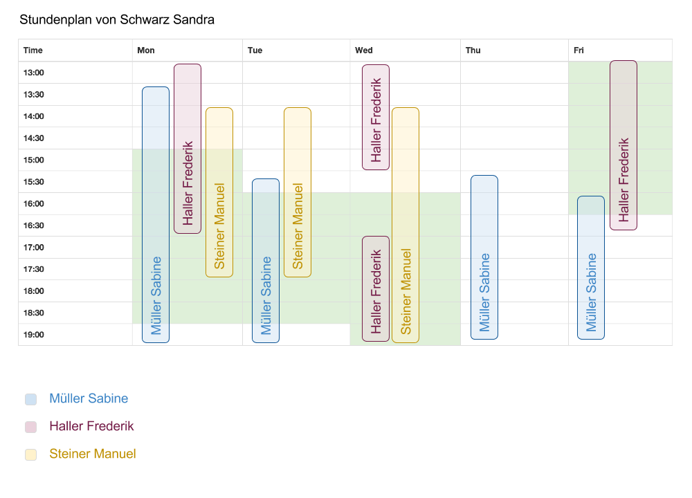

# Design

## Mocks

### Erfassen der Zeitfenster eines Schülers / Mentors

Die bisherige Lösung verfügt bereits über eine Möglichkeit, die Zeitfenster eines Schülers und Mentors einzugeben, welche die Anforderungen des Kunden erfüllen. Allerdings wird beim Schüler dieser Bildschirm noch für die Auswahl der Mentoren zusätzlich genutzt (siehe Problem \ref{prob-01}). Wie in Abbildung \ref{mock_timetable_select_schedule} gezeigt, werden daher die Funktionalitäten zur Mentorenauswahl von diesem Bildschirm entfernt. Ebenso werden unnütze Bedienelemente wie in \ref{prob-02} beanstandet entfernt.

### Auswahl der Mentoren

Für die Auswahl der Mentoren wird ein neuer Bildschirm erstellt. Er dient dazu, aus allen im System erfassten Mentoren zu filtern und die Zeitfenster der ausgewählten Mentoren mit denen des Schülers zu vergleichen. Dazu stehen diverse Filtermöglichkeiten zur Verfügung. Weiterhin soll es möglich sein, ein Treffen zwischen Mentor und Schüler zu persistieren (Wochentag und Zeitpunkt), gemäss \ref{sc-015}. Diese direkte Zuweisung reduziert die in \ref{prob-04} beanstandeten Anzahl Klicks.

#### Filter und Auswahl für den Vergleich

Die Auswahl der Mentoren geschieht in zwei Schritten:

1. Filter definieren die zur Auswahl stehenden Mentoren, diese sollen initial auf sinnvolle Werte gesetzt sein.
2. Aus den gefilterten Mentoren können bestimmte Mentoren für den Vergleich mit dem Schüler ausgewählt werden. 

Durch dieses Zwei-Schritte Verfahren soll sichergestellt werden, dass die Übersicht sowohl bei vielen möglichen Mentoren, als auch im Fall, dass nur wenige passende Mentoren zur Verfügung stehen, nicht eingeschränkt ist. 

(TODO: mock)

### Vergleich der Zeitfenster als Kalenderansicht

Damit die Darstellung auch bei mehreren Mentoren übersichtlich bleibt, bietet sich eine Kalenderartige Darstellung der Zeitfenster an.

Abbildung \ref{mock_timetable_mentors} zeigt eine mögliche Darstellung des Stundenplan eines Schülers, wobei die Zeitfenster des Schülers grün hinterlegt sind. Es wurden drei Mentoren zum Vergleich ausgewählt und mit jeweils unterschiedlichen Farben dargestellt. Werden noch mehr Mentoren ausgewählt, so werden die Balken entsprechend kleiner. Es ist dabei auch möglich, dass die Beschriftungen auf den Balken nicht mehr lesbar sind. Daher wird unterhalb eine Legende eingeblendet. Die Farben können aus einer Palette oder mittels Farb-Rotation ausgewählt werden. 

Die maximale Anzahl anzeigbarer Mentoren sollte allenfalls eingeschränkt werden, damit sich die Farben nicht wiederholen und die Balken eine vernünftige Breite beibehalten.

In der Abbildung sind Zeitfenster von Mentoren, die sich nur knapp oder gar nicht mit dem des Schülers überschneiden, nicht speziell berücksichtigt (z.b. Müller Sabine am Donnerstag und Freitag). Es wäre denkbar, diese ein- und ausblendbar zu machen oder anders zu kennzeichnen (schmaler, andere Farbgebung, Transparenz).

### Auswahl des Zeitpunkt des Treffens

Möchte ein Administrator den Zeitpunkt des Treffens auswählen, so kann auf eine Zelle des Stundenplans gelickt werden, wie in Abbildung \ref{\ref{mock_timetable_mentors_select} gezeigt.

